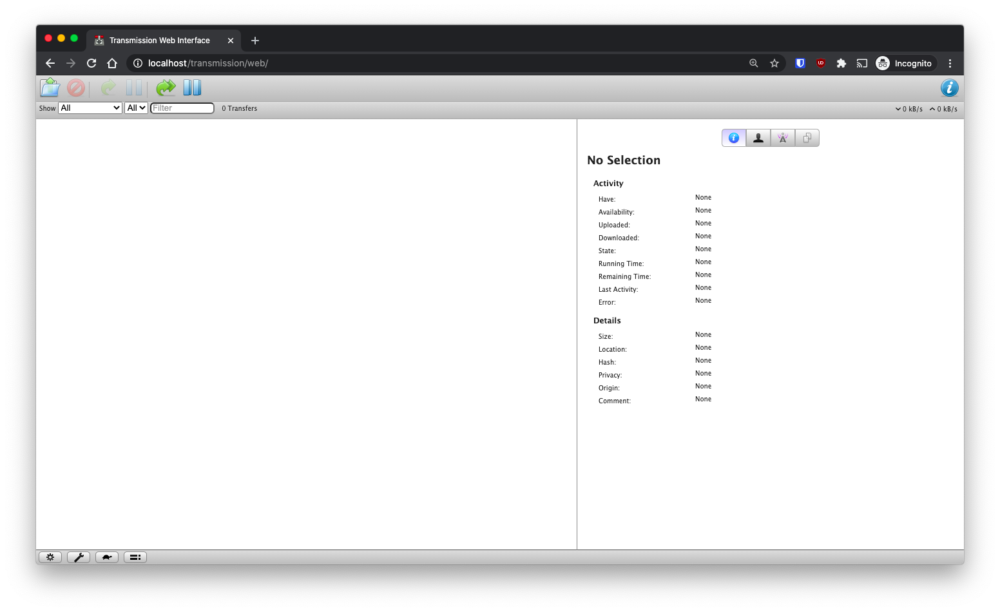

# Docker container for Transmission

Transmission is a fast, easy, and free BitTorrent client. Visit [https://transmissionbt.com/](https://transmissionbt.com/) for more information.

## Build status
[](https://github.com/romanrabodzei/Transmission-Docker/actions/workflows/workflow.yml)

## Run a container 
```bash
docker container run \
--detach \
--name transmission \
--publish 8080:8080/tcp \
--volume /incompleted/:/incompleted \
--volume /completed/:/completed \
romanrabodzei/transmission:latest
```

`--volume /incompleted/:/your_folder` - set a folder for temp files

`--volume /completed/:/your_folder` - set a folder for completed tasks

## Setting up a username and password

The default username is *transmission* and the password is *transmission*. To set up your own username and password change the following lines in the settings.json file
```json
"rpc-password": "password",
"rpc-username": "username",
```

Then build a docker image and run it

```bash
docker build -t transmission:latest -f ./Dockerfile.transmission .

docker container run \
--detach \
--name transmission \
--publish 8080:8080/tcp \
--volume /incompleted/:/incompleted \
--volume /completed/:/completed \
transmission:latest
```


